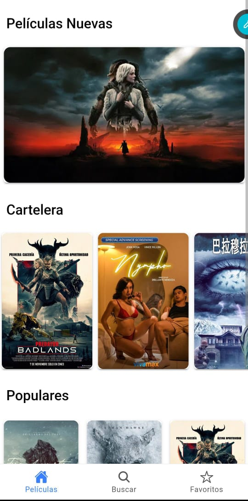
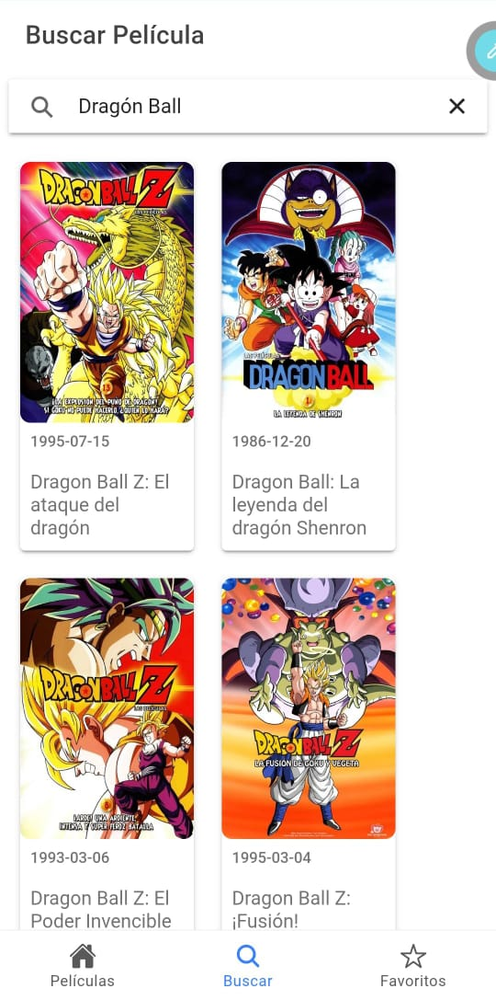
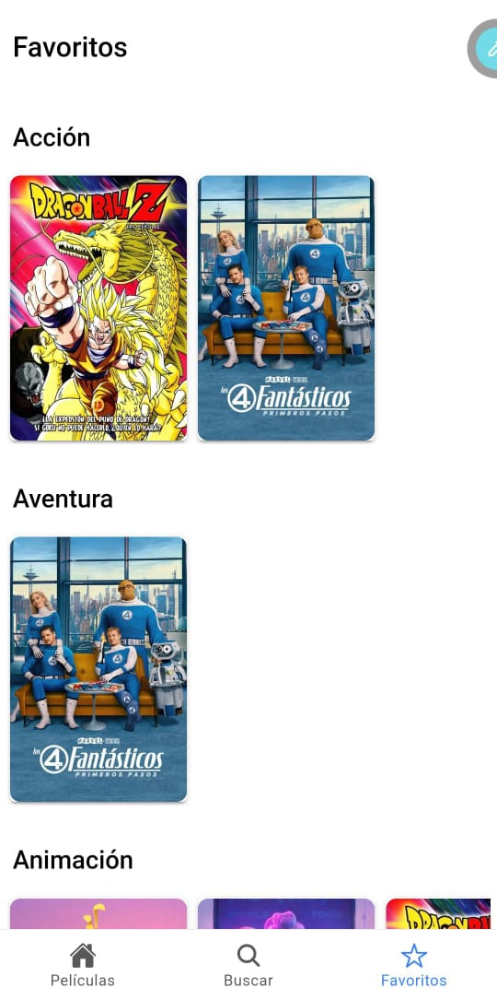

# 🎬 Peliculas App

Aplicación Ionic + Angular que consume la API de TMDB para mostrar cartelera, peliculas populares y detalles de la pelicula, con guardado de favoritos locales y barra de búsqueda.

<p align="center">
	<a href="https://peliculasappahm.netlify.app" target="_blank" rel="noopener">
		
	</a>
</p>

## 🧩 Tecnologías y características

- Angular 20 + Ionic 6
- Swiper 12 para carruseles responsivos
- Pipes personalizados: `imagen`, `filtroImagen`
- Service Worker habilitado (para subirlo como PWA)
- Búsqueda con por Enter o click
- Ionic Storage (localforage) para guardar localmente elementos favoritos

[](https://angular.dev)
[](https://ionicframework.com)
[](https://www.typescriptlang.org)
[](https://rxjs.dev)
[](https://swiperjs.com)
[](https://web.dev/progressive-web-apps/)


## 🚀 Instalación y ejecución local

```bash
# Instalar dependencias
npm install

# Abrir en desarrollo
ionic serve -o

# Build producción (genera www/ con PWA)
npm run build

# Ejecutar tests
npm test

```

Requisitos: Node 18+, npm 9+. Configura tu apiKey en `src/environments/` .
API de `https://www.themoviedb.org`


## 📂 Estructura principal

```
src/app/components/          # Componentes UI
src/app/services/            # Servicios de datos y TMDB
src/app/pipes/               # Pipes personalizados
src/app/interfaces/          # Interfaces TS
src/assets/                  # Imágenes y recursos
```

## 🔐 Entorno

Editar API/URLs en `src/environments/` según sea necesario.

## 📷 Capturas de pantalla

| Inicio | Detalles |
|------|-----------|
|  |  |

| Búsqueda | Favoritos |
|--------|----------|
|  |  |


## 🙌 Créditos

- Curso de Ionic de Fernando Herrera (Udemy).
  
  https://www.udemy.com/course/ionic-ios-android-pwa-appstore-playstore-push/?kw=Ionic+6%3A&src=sac&couponCode=PMNVD2525
  
- TMDB por la API y recursos.

  https://www.themoviedb.org


> “This product uses the TMDB API but is not endorsed or certified by TMDB.”

Hecho por Adolfo Huerta Martinez.

© 2025 GALCEX
